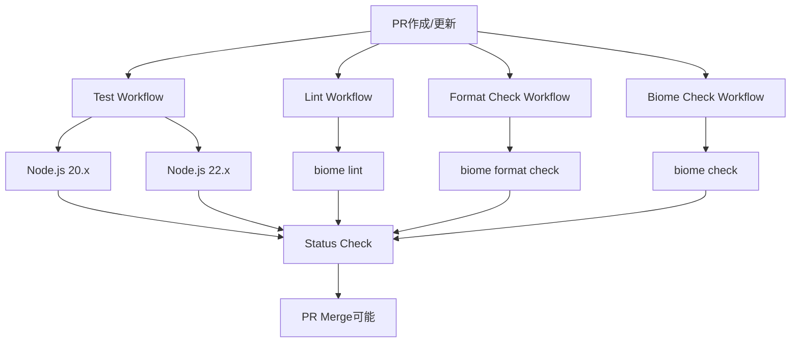

# 設計書

## 概要

GitHub Actionsを使用して、プロジェクトに包括的なCI/CDパイプラインを実装します。4つの独立したワークフローファイルを作成し、テスト、リント、フォーマット、Biome checkを並列実行します。すべてのワークフローはPRマージの必須条件として設定され、コード品質を保証します。

## アーキテクチャ

### ワークフロー構成



### ファイル構造

```
.github/
└── workflows/
    ├── test.yml          # ユニットテスト実行
    ├── lint.yml          # リントチェック
    ├── format.yml        # フォーマットチェック
    └── biome-check.yml   # Biome総合チェック
```

## コンポーネントと インターフェース

### 1. Test Workflow (test.yml)

**目的**: 複数のNode.jsバージョンでユニットテストを実行

**トリガー**: 
- Pull request作成・更新
- mainブランチへのpush

**実行内容**:
- Node.js 20.x、22.xのマトリックス実行
- 依存関係のキャッシュ
- `npm run test`の実行
- テスト結果の報告

### 2. Lint Workflow (lint.yml)

**目的**: コードのリント検査

**トリガー**:
- Pull request作成・更新
- mainブランチへのpush

**実行内容**:
- Node.js最新LTSでの実行
- `npm run lint`の実行
- リントエラーの詳細報告

### 3. Format Check Workflow (format.yml)

**目的**: コードフォーマットの検証

**トリガー**:
- Pull request作成・更新
- mainブランチへのpush

**実行内容**:
- Node.js最新LTSでの実行
- `biome format --check src/`の実行
- フォーマット違反の報告

### 4. Biome Check Workflow (biome-check.yml)

**目的**: Biomeの総合品質チェック

**トリガー**:
- Pull request作成・更新
- mainブランチへのpush

**実行内容**:
- Node.js最新LTSでの実行
- `npm run check`の実行
- 総合的な品質問題の報告

## データモデル

### ワークフロー共通設定

```yaml
# 共通環境変数
env:
  NODE_ENV: test
  CI: true

# 共通キャッシュキー
cache-key: ${{ runner.os }}-node-${{ hashFiles('**/package-lock.json') }}
```

### マトリックス設定（テストワークフロー用）

```yaml
strategy:
  matrix:
    node-version: ['20.x', '22.x']
    os: [ubuntu-latest]
```

## エラーハンドリング

### 1. 依存関係インストール失敗

**対応**: 
- npm ciの失敗時は明確なエラーメッセージを表示
- キャッシュクリアの提案を含める

### 2. テスト失敗

**対応**:
- 失敗したテストケースの詳細を表示
- Node.jsバージョン別の結果を明確に分離

### 3. リント・フォーマットエラー

**対応**:
- 具体的なファイルと行番号を表示
- 修正方法の提案を含める

### 4. ワークフロー実行タイムアウト

**対応**:
- 各ワークフローに適切なタイムアウト設定（10分）
- タイムアウト時の明確なエラーメッセージ

## テスト戦略

### 1. ワークフロー単体テスト

- 各ワークフローファイルの構文検証
- 必要なアクションとステップの存在確認

### 2. 統合テスト

- 実際のPR作成によるワークフロー実行テスト
- 各種エラーケースでの動作確認

### 3. パフォーマンステスト

- キャッシュ効果の確認
- 並列実行による実行時間短縮の検証

### 4. ブランチ保護ルール設定

- 必須ステータスチェックの設定確認
- マージブロック機能の動作確認

## 実装詳細

### キャッシュ戦略

```yaml
- name: Cache dependencies
  uses: actions/cache@v4
  with:
    path: ~/.npm
    key: ${{ runner.os }}-node-${{ hashFiles('**/package-lock.json') }}
    restore-keys: |
      ${{ runner.os }}-node-
```

### 並列実行最適化

- 各ワークフローは独立して実行
- 共通の依存関係インストールステップを最適化
- 最も時間のかかるテストワークフローを優先実行

### セキュリティ考慮事項

- `actions/checkout@v4`の最新バージョン使用
- `actions/setup-node@v4`の最新バージョン使用
- 最小権限の原則に従ったpermissions設定

### ブランチ保護設定

GitHub リポジトリ設定で以下を構成：

```
Required status checks:
- Test (Node.js 20.x)
- Test (Node.js 22.x)
- Lint
- Format Check
- Biome Check

Require branches to be up to date: true
Restrict pushes that create files: false
```
